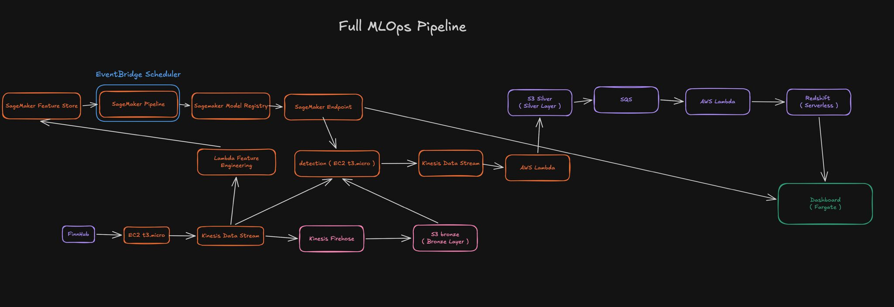

# mag10-monitor-aws

**A production-grade, real-time market intelligence pipeline and MLOps loop running on AWS — built end-to-end from ingestion to automated retraining.**

Started as a project at [Harbour.Space](https://harbour.space/); rebuilt from the ground up as a real AWS deployment: live WebSocket ingestion, a medallion (bronze/silver/gold) data lake, four stateful anomaly detectors, a full SageMaker training → registry → endpoint loop, and a Streamlit dashboard — all running on two `t3.micro` EC2 instances with no GPU, using only the Finnhub free tier.

> Originally prototyped as [mag10-monitor](https://github.com) on GCP. This is a full rebuild on AWS: detection algorithms carried over conceptually, but infrastructure, SDK integration, and the entire ML pipeline (training, model registry, gated deployment, scheduled retraining) are new.

---

## Highlights

- **End-to-end MLOps loop** — SageMaker Pipeline (processing → training → evaluation → conditional gate → registry) triggered automatically every weekday after market close via EventBridge Scheduler, with a manual-approval gate before any model reaches production.
- **Real-time streaming architecture** — Finnhub WebSocket → Kinesis Data Streams fanning out to three independent consumers (bronze archive, feature engineering, live detection), processing trades for 10 equities in real time.
- **Medallion data architecture** — Bronze (raw trades in S3) → Silver (detected signals in S3) → Gold (Redshift Serverless), each layer serving a distinct purpose (warm-start recovery, ML training data, dashboard queries).
- **Cost-conscious infrastructure** — the entire ingestion + detection path runs on two `t3.micro` EC2 instances; no GPU instances, no paid data feed, ECS Fargate only for the dashboard.
- **Infrastructure as code** — 11 Terraform modules covering VPC, EC2, Kinesis, S3, Lambda, Redshift, ECS, ECR, SageMaker, EventBridge Scheduler, and IAM.
- **Secure by design** — no hardcoded credentials anywhere; all secrets resolved at runtime via AWS Secrets Manager, IAM instance profiles, and Lambda execution roles.

---

## Full MLOps Pipeline



---

## Tech Stack

| Layer | Technology |
|-------|-----------|
| Ingestion | Finnhub WebSocket API, Python, EC2 (`t3.micro`) |
| Streaming | Amazon Kinesis Data Streams, Kinesis Firehose |
| Compute | AWS Lambda, ECS Fargate |
| Storage | Amazon S3 (bronze/silver), Redshift Serverless (gold) |
| ML / MLOps | Amazon SageMaker (Pipelines, Feature Store, Model Registry, Endpoints), scikit-learn (IsolationForest) |
| Orchestration | Amazon EventBridge Scheduler |
| Dashboard | Streamlit |
| Infrastructure as Code | Terraform (11 modules) |
| Package Management | [uv](https://docs.astral.sh/uv/) (per-service `pyproject.toml` + lockfile) |

---

## Tracked Symbols

| Symbol | Name | Group |
|--------|------|-------|
| AAPL | Apple | MAG 7 |
| MSFT | Microsoft | MAG 7 |
| NVDA | NVIDIA | MAG 7 |
| GOOGL | Alphabet | MAG 7 |
| AMZN | Amazon | MAG 7 |
| META | Meta Platforms | MAG 7 |
| TSLA | Tesla | MAG 7 |
| AMD | Advanced Micro Devices | Extended |
| AVGO | Broadcom | Extended |
| PLTR | Palantir | Extended |

---

## Signal Types

| Signal | What it detects | Cadence |
|--------|----------------|---------|
| `volume_spike` | Unusual trade volume burst | On threshold breach |
| `momentum_signal` | Sustained directional price movement | On threshold breach |
| `volatility_spike` | Abnormal price variance within a window | On threshold breach |
| `sector_snapshot` | Aggregate state across all 10 symbols | Every 60 seconds |

Every signal carries an `ml_anomaly_score` (0.0–1.0) from the SageMaker endpoint. The algorithmic threshold is the signal gate; the ML score is additive only.

---

## Architecture

```
Finnhub WebSocket
      │
      ▼
websocket/ (EC2 t3.micro)
  validates raw trades → publishes to Kinesis: mag10-raw-trades
      │
      ├──► Kinesis Firehose → S3 bronze/          (Bronze)
      ├──► Lambda feature-eng → SageMaker Feature Store
      └──► detection/ (EC2 t3.micro)
             4 stateful detectors + SageMaker anomaly score
             → Kinesis: mag10-processed-signals
                    │
                    ▼
             Lambda signal-archive → S3 silver/   (Silver)
                    │
               S3 Event → SQS → Lambda s3-to-redshift
                    │
                    ▼
             Redshift Serverless mag10.*           (Gold)
                    │
                    ▼
             Streamlit Dashboard (ECS Fargate / ALB)
               6 tabs: Live Signals, Volume, Momentum & Correlation,
               Volatility & Sector, Analytics, ML Insights

Automatic ML retraining (weekdays 4:15 PM ET):
  EventBridge Scheduler (mag10-retrain-schedule)
      → SageMaker Pipeline: mag10-training-pipeline
          Processing → Training → Evaluation → ConditionStep → RegisterModel
      → Manual approval in Model Registry
      → SageMaker Endpoint: mag10-anomaly-endpoint
```

---

## Data Layers

| Layer | Storage | Contents |
|-------|---------|----------|
| Bronze | S3 `bronze/` | Raw validated trades — immutable, used for warm-start |
| Silver | S3 `silver/` | Detected signals — archived for audit and ML training |
| Gold | Redshift Serverless | Served directly to the Streamlit dashboard |

---

## Repository Structure

```
mag10-monitor-aws/
├── spec/                          # Source of truth — read before coding
│   ├── overview.md
│   ├── data-sources.md
│   ├── detectors/                 # volume, momentum, volatility, sector
│   ├── pipeline/                  # listener, kinesis, bronze, lambda, redshift, ml
│   ├── dashboard/
│   └── infra/
│
├── websocket/                     # EC2 t3.micro — Finnhub ingestion
├── detection/                     # EC2 t3.micro — signal detection + ML scoring
├── lambda/
│   ├── signal_archive/            # Kinesis → S3 silver
│   ├── s3_to_redshift/            # S3 silver → Redshift
│   └── feature_eng/               # Kinesis → SageMaker Feature Store
│
├── ml/                            # SageMaker pipeline scripts
│   ├── pipeline.py
│   ├── preprocessing/
│   ├── training/
│   ├── evaluation/
│   └── inference/
│
├── dashboard/                     # ECS Fargate — Streamlit UI (6 tabs)
├── infra/                         # Terraform — all AWS resources (11 modules)
│   ├── modules/
│   │   ├── vpc/, ec2/, kinesis/, s3/, lambda/
│   │   ├── redshift/, ecs/, ecr/, sagemaker/
│   │   ├── scheduler/, iam/
│   └── sql/
│       └── create_tables.sql      # Redshift DDL (run once by deploy.sh)
└── scripts/
    ├── deploy.sh                  # Full deploy
    ├── deploy_lambdas.sh          # Lambda-only redeploy
    ├── ec2-userdata-websocket.sh
    └── ec2-userdata-detection.sh
```

---

## Prerequisites

- AWS account with appropriate IAM permissions
- [Terraform](https://developer.hashicorp.com/terraform) >= 1.5
- [uv](https://docs.astral.sh/uv/) (Python package manager — `pip` is not used in this project)
- Docker
- Finnhub API key (free tier is sufficient)

---

## Configuration

Copy `.env.example` to `.env` for local development. **Never commit `.env`.**

| Variable | Used by | Source |
|----------|---------|--------|
| `FINNHUB_API_KEY` | websocket | AWS Secrets Manager |
| `AWS_REGION` | all services | EC2 instance metadata |
| `KINESIS_STREAM_RAW_TRADES` | websocket, detection, feature-eng | env |
| `KINESIS_STREAM_PROCESSED` | detection, signal-archive | env |
| `S3_BUCKET_RAW` | detection, signal-archive | env |
| `SAGEMAKER_ENDPOINT_NAME` | detection | env |
| `REDSHIFT_HOST` | dashboard, s3-to-redshift | Terraform output |
| `REDSHIFT_DB` | dashboard, s3-to-redshift | env |
| `REDSHIFT_USER` | dashboard, s3-to-redshift | AWS Secrets Manager |
| `REDSHIFT_PASSWORD` | dashboard, s3-to-redshift | AWS Secrets Manager |
| `DASHBOARD_PASSWORD` | dashboard | AWS Secrets Manager |

All secrets are stored in AWS Secrets Manager and injected at runtime. IAM credentials are provided by EC2 instance profiles and Lambda execution roles — never use access key IDs in code.

---

## Deployment

```bash
# Full deploy: build + push 6 Docker images to ECR, terraform apply, create Redshift schema
./scripts/deploy.sh

# Lambda-only redeploy (no infra changes)
./scripts/deploy_lambdas.sh
```

`deploy.sh` outputs the ALB DNS name (dashboard URL) on completion. After the first deploy, populate the two required secrets:

```bash
aws secretsmanager put-secret-value --secret-id mag10-finnhub-key \
    --secret-string '{"api_key":"YOUR_KEY"}'

aws secretsmanager put-secret-value --secret-id mag10-dashboard-password \
    --secret-string '{"password":"YOUR_PASSWORD"}'
```

> **Note:** The SageMaker endpoint (`mag10-anomaly-endpoint`) is created after the first ML pipeline run and manual model approval — it is not provisioned by `terraform apply`.

---

## ML Retraining

Training runs automatically after each US market close.

| Trigger | `mag10-retrain-schedule` (EventBridge Scheduler) |
|---------|--------------------------------------------------|
| Schedule | Weekdays 4:15 PM ET (`cron(15 16 ? * MON-FRI *)`) |
| Target | `sagemaker:StartPipelineExecution` on `mag10-training-pipeline` |

Pipeline steps: feature engineering → IsolationForest training → evaluation → condition check (anomaly rate 3–20%) → model registration with `PendingManualApproval`.

After the pipeline completes, **manually approve** the model version in the SageMaker Model Registry. Endpoint update does not happen automatically — manual approval is the gate.

---

## Package Management

This project uses `uv` exclusively.

```bash
# Install dependencies
uv sync

# Add a dependency
uv add <package>

# Run a script
uv run python main.py
```

Each service (`websocket/`, `detection/`, `dashboard/`, each Lambda) has its own isolated `pyproject.toml` and `uv.lock`. Always commit `uv.lock`.

---

## Non-Goals

- No trading or order placement
- No options, futures, or non-equity instruments
- No pre-market or after-hours signal detection
- No alert routing (email, SMS, Slack) — dashboard is the only output surface
- No historical backfill — pipeline is live-forward only
- No automated model deployment — Model Registry approval is always manual
